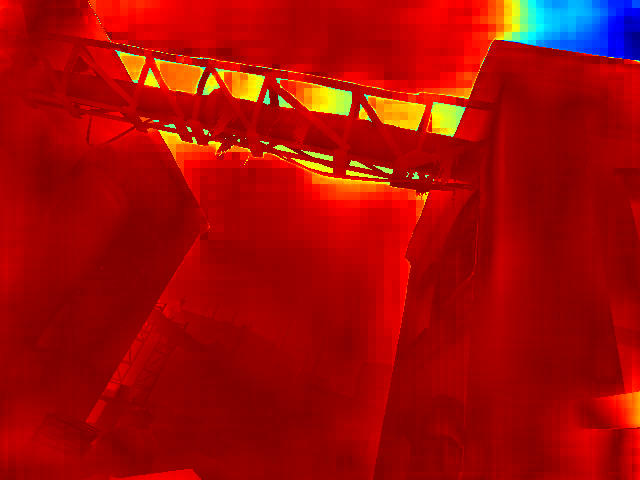
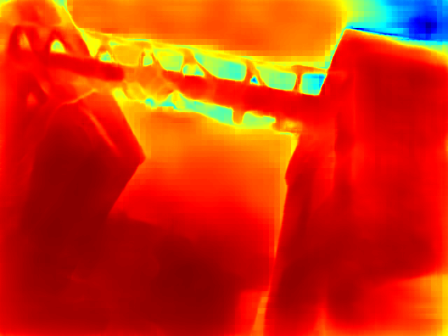
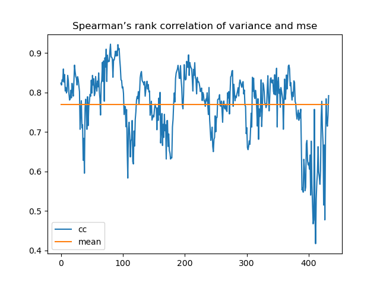
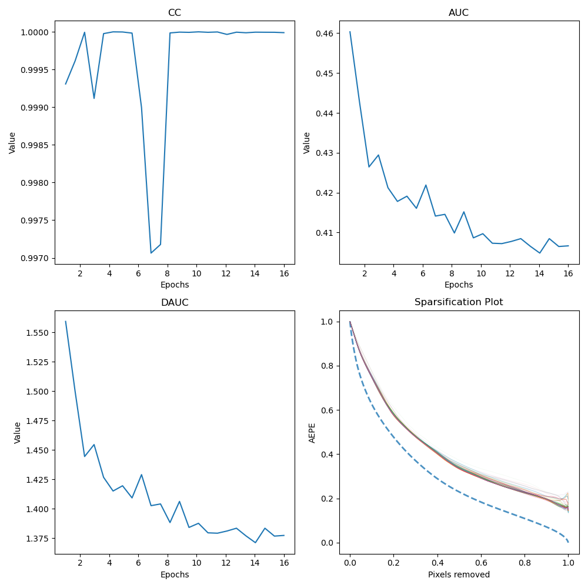

# cov_toolkit

This repo contains a set of tools to help with the analysis of covariance data.

## End Points Error

The simplest way to evaluate the quality of a estimated optical flow is to compute the end points error (EPE). This metric is defined as the average Euclidean distance between the estimated and ground truth flow vectors.

Here is an example of EPE map computed on the [TartanAir](https://theairlab.org/tartanair-dataset/) dataset:

Ground truth flow

Estimated flow([FlowFormer](https://drinkingcoder.github.io/publication/flowformer/) model) and EPE map

## Estimated Covariance

We can estimate the reliability of the predicted flow by using uncertainty measures. For example, this uncertainty can be modeled in  Monte Carlo (MC) fashion by sampling multiple times from the predicted distribution. See this [paper](https://arxiv.org/abs/2107.03342) to learn more about the uncertainty estimation.

After we have the estimated covariance, like the covariance map below, we need a quantitative method to check the quality of the estimated covariance (Cov).

## Spearman Correlation Coefficient

The [Spearman correlation coefficient](https://en.wikipedia.org/wiki/Spearman%27s_rank_correlation_coefficient) (CC) is defined as the Pearson correlation coefficient between the rank variables. This indicator allows us to compare trends in two sets of data without taking into account the effect of the scale of the data.

One of the simplest methods is to directly calculate the CC between EPE and Cov. The figure below shows the results of this metric applied to a small dataset, which allows us to initially localize the results of the prediction on that image with a large error, but it is difficult to know how a certain algorithm performs on the same image.

## Sparsification plot

Sparsification plots are commonly considered as a good way to evaluate the quality of the estimated covariance. The steps to generate a sparsification plot are as follows:

- Sort the flow in descending order of uncertainty, then take a small portion of those depth values at a time (without putting them back) and then calculate the average EPE (AEPE) on the rest. This method would allow you to calculate if the uncertainty is low or not and the calculated error would be lower.
  
- At the same time to draw an ideal curve, the ideal sparsification plot is based on the order of the EPE map, repeat the same process as above, then we can get the *Oracle* curve.

- Finally, we can calculate the area under the curve (AUC) to compare the performance of different uncertainty measures over an entire dataset.

[ProbFlow](https://arxiv.org/abs/1708.06509) calculates the CC between the Oracle curve and the estimated uncertainty curve, which estimates how well the examined uncertainty values can be mapped onto the corresponding endpoint errors using an arbitrary monotonic function.

We can also calculate Cov_AUC/Oracle_AUC (DAUC) to evaluate the quality in different pictures.

These methods can be used equally well in the training process of uncertainty networks.

